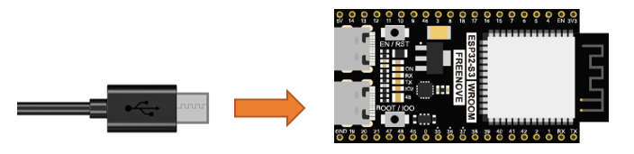
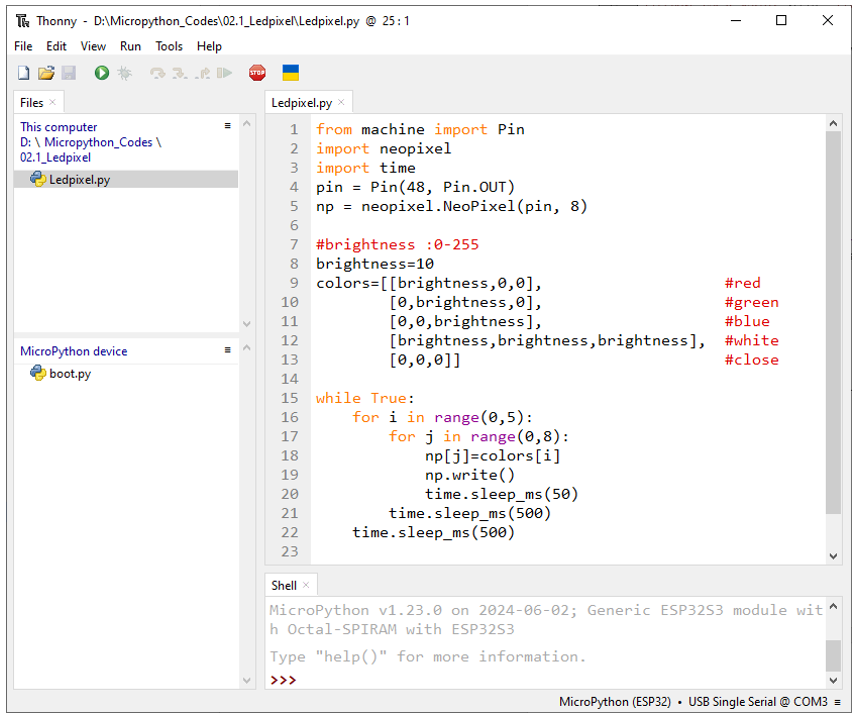
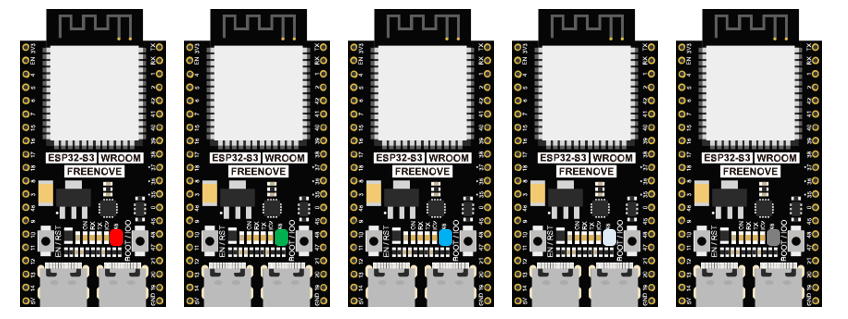
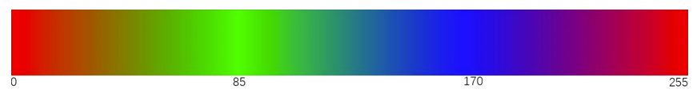
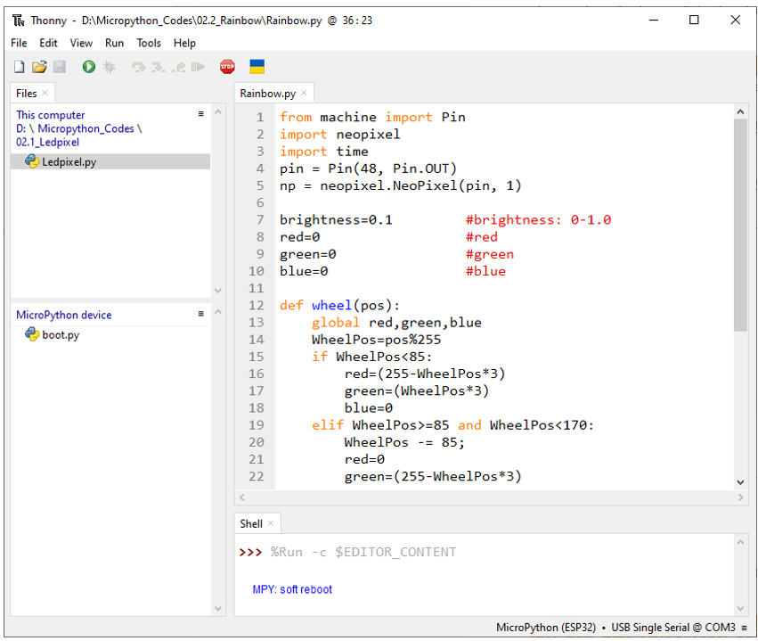

##############################################################################
Chapter LEDPixel
##############################################################################

This chapter will help you learn to use a more convenient RGB LED lamp, which requires only one GPIO control and can be connected in infinite series in theory. Each LED can be controlled independently.

Project 2.1 LEDPixel
*******************************

Learn the basic usage of ws2812 and use it to flash red, green, blue and white.

Circuit
==============================

Connect your computer and ESP32-S3 WROOM with a Type C cable.

Code
================================

Move the program folder "Freenove_ESP32_S3_WROOM_Board_Lite/Python/Python_Codes" to disk(D) in advance with the path of "D:/Micropython_Codes".

Open "Thonny", click "This computer" -> "D:" -> "Micropython_Codes" -> "02.1_Ledpixel" and double click "LedPixel.py". 

02.1_Ledpixel
------------------------------

Click "Run current script", and LedPixel begins to light up in red, green, blue, white and black. 

The following is the program code:

.. literalinclude:: ../../../freenove_Kit/Python/Python_Codes/02.1_Ledpixel/Ledpixel.py
    :linenos: 
    :language: python
    :lines: 1-22
    :dedent:

Import Pin, neopiexl and time modules.

.. literalinclude:: ../../../freenove_Kit/Python/Python_Codes/02.1_Ledpixel/Ledpixel.py
    :linenos: 
    :language: python
    :lines: 1-3
    :dedent:

Define the number of pin and LEDs connected to neopixel.

.. literalinclude:: ../../../freenove_Kit/Python/Python_Codes/02.1_Ledpixel/Ledpixel.py
    :linenos: 
    :language: python
    :lines: 4-5
    :dedent:

Define the brightness of neopixel's LED and an array to store color.

.. literalinclude:: ../../../freenove_Kit/Python/Python_Codes/02.1_Ledpixel/Ledpixel.py
    :linenos: 
    :language: python
    :lines: 7-13
    :dedent:

Assign the color data to the array np and call function write() to send np array data to neopixel module.

.. literalinclude:: ../../../freenove_Kit/Python/Python_Codes/02.1_Ledpixel/Ledpixel.py
    :linenos: 
    :language: python
    :lines: 18-19
    :dedent:

Nest two for loops to make the module repeatedly display five states of red, green, blue, white and OFF.

.. literalinclude:: ../../../freenove_Kit/Python/Python_Codes/02.1_Ledpixel/Ledpixel.py
    :linenos: 
    :language: python
    :lines: 15-22
    :dedent:

Reference
----------------------------------

.. py:function:: Class neopixel	

    Before each usr of **neopixel** module, please add the statement "import neopixel" to the top of Python file.

    **NeoPixel(pin, n):** Define the number of output pins and LEDs of neopixel module 

        **pin:** Output pins

        **n:** The number of LEDs.

    **NeoPixel.write():** Write data to LEDs.

Project 2.2 Rainbow Light
*********************************

In the previous project, we have mastered the use of LEDPixel. This project will realize a slightly complicated rainbow light. The component list and the circuit are exactly the same as the project fashionable light.

Code
=================================

Continue to use the following color model to equalize the color distribution of the 8 leds and gradually change. 

Move the program folder " **Freenove_ESP32_S3_WROOM_Board_Lite/Python/Python_Codes** " to disk(D) in advance with the path of " **D:/Micropython_Codes** ".

Open "Thonny", click "This computer" -> "D:" -> "Micropython_Codes" -> "02.2_Rainbow" and then double click "Rainbow_light.py". 

02.2_Rainbow
---------------------------------

Click "Run current script", and the Ledpixel displays different colors and the color changes gradually.

The following is the program code:

.. literalinclude:: ../../../freenove_Kit/Python/Python_Codes/02.2_Rainbow/Rainbow.py
    :linenos: 
    :language: python
    :lines: 1-36
    :dedent:

Define a wheel() function to process the color data of neopixel module.

.. literalinclude:: ../../../freenove_Kit/Python/Python_Codes/02.2_Rainbow/Rainbow.py
    :linenos: 
    :language: python
    :lines: 12-28
    :dedent:

Set the color brightness of the module.

.. literalinclude:: ../../../freenove_Kit/Python/Python_Codes/02.2_Rainbow/Rainbow.py
    :linenos: 
    :language: python
    :lines: 7-7
    :dedent:

Use a nesting of two for loops. The first for loop makes the value of i increase from 0 to 255 automatically and the wheel() function processes the value of i into data of the module’s three colors; the second for loop writes the color data to the module.

.. literalinclude:: ../../../freenove_Kit/Python/Python_Codes/02.2_Rainbow/Rainbow.py
    :linenos: 
    :language: python
    :lines: 31-36
    :dedent: