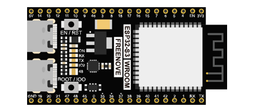
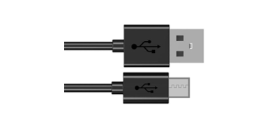
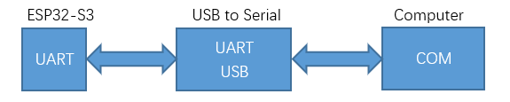
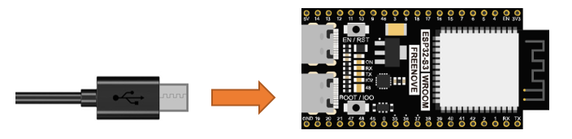
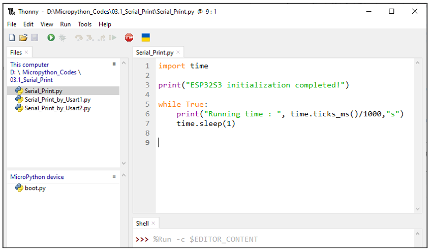
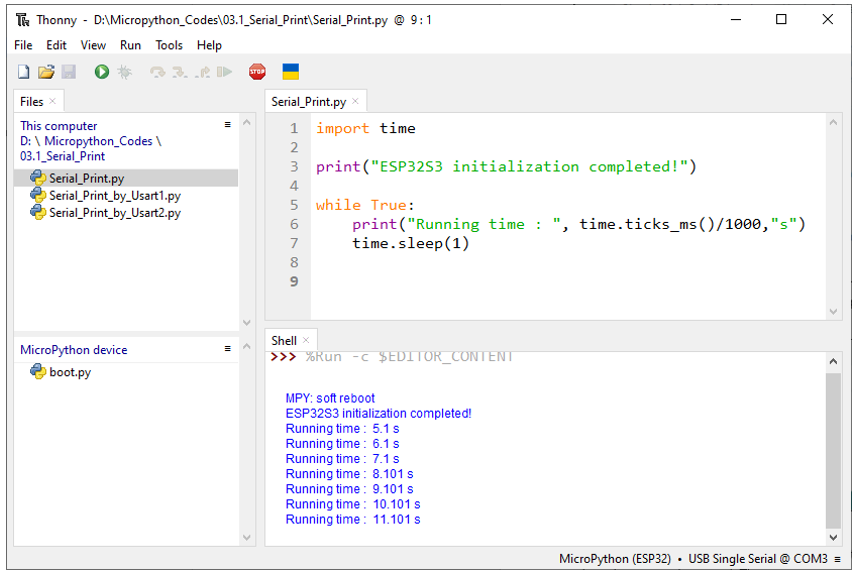
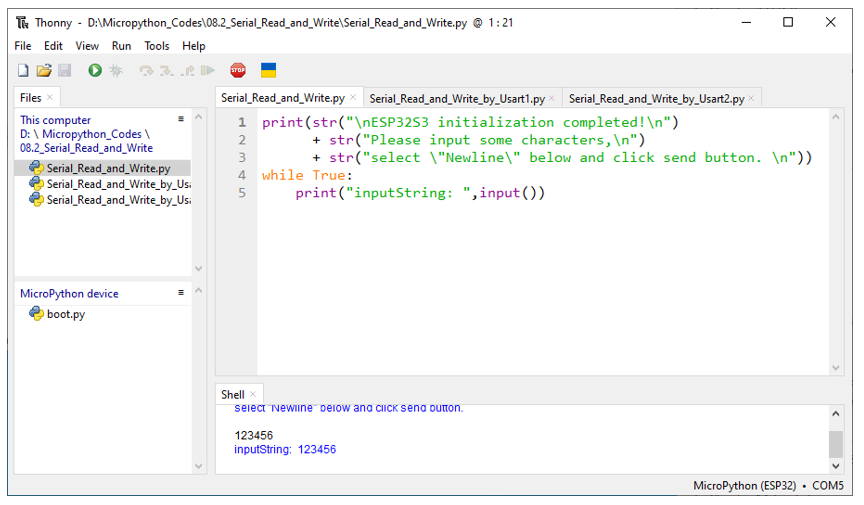

##############################################################################
Chapter Serial Communication
##############################################################################

Serial Communication is a means of communication between different devices/devices. This section describes ESP32-S3’s Serial Communication.

Project 3.1 Serial Print
************************************

This project uses ESP32-S3's serial communicator to send data to the computer and print it on the serial monitor.

Component List
===============================

.. list-table:: 
   :width: 100%
   :header-rows: 1 
   :align: center
   
   * -  ESP32-S3 WROOM x1
     -  USB cable x1

   * -  |Chapter01_00|
     -  |Chapter01_01|

Related knowledge
===============================

Serial communication
-------------------------------

Serial communication generally refers to the Universal Asynchronous Receiver/Transmitter (UART), which is commonly used in electronic circuit communication. It has two communication lines, one is responsible for sending data (TX line) and the other for receiving data (RX line). The serial communication connections of two devices is as follows:

.. image:: ../_static/imgs/3_Serial_Communication/Chapter03_00.png
    :align: center

Before serial communication starts, the baud rate of both sides must be the same. Communication between devices can work only if the same baud rate is used. The baud rates commonly used is 9600 and 115200.

Serial port on ESP32-S3
-------------------------------

Freenove ESP32-S3 has integrated USB to serial transfer, so it could communicate with computer connecting to Type C cable.

Circuit
==========================

Connect Freenove ESP32-S3 to the computer with Type C cable.

Code
======================

Move the program folder "Freenove_ESP32_S3_WROOM_Board_Lite/Python/Python_Codes" to disk(D) in advance with the path of "D:/Micropython_Codes".

Open "Thonny", click "This computer" -> "D:" -> "Micropython_Codes" -> "03.1_Serial_Print" and double "Serial_Print.py". 

03.1_Serial_Print
--------------------------------

Click "Run current script" and observe the changes of "Shell", which will display the time when ESP32-S3 is powered on once per second. 

The following is the program code:

.. literalinclude:: ../../../freenove_Kit/Python/Python_Codes/03.1_Serial_Print/Serial_Print.py
    :linenos: 
    :language: python
    :lines: 1-7
    :dedent:

ESP32-S3 has 3 serial ports, one of which is used as REPL, that is, Pin(43) and Pin(44) are occupied, and generally it is not recommended to be used as tx, rx. The other two serial ports can be configured simply by calling the UART module.

.. image:: ../_static/imgs/3_Serial_Communication/Chapter03_10.png
    :align: center

Reference
-------------------------------

.. py:function:: Class UART
    
    Before each use of **UART** module, please add the statement "from machine import UART" to the top of python file.

    **UART(id, baudrate, bits, parity, rx, tx, stop, timeout):** Define serial ports and configure parameters for them.
    
        **id:** Serial Number. The available serial port number is 1 or 2 
        
        **baudrate:** Baud rate
        
        **bits:** The number of each character.
        
        **parity:** Check even or odd, with 0 for even checking and 1 for odd checking.
        
        **rx, tx:** UAPT's reading and writing pins
        
                    Note: Pin(1) and Pin(3) are occupied and not recommend to be used as tx,rx.
        
        **stop:** The number of stop bits, and the stop bit is 1 or 2.
        
        **timeout:** timeout period (Unit: millisecond)
    
                    0 < timeout ≤ 0x7FFF FFFF (decimal: 0 < timeout ≤ 2147483647)
    
    **UART.init(baudrate, bits, parity, stop, tx, rx, rts, cts)):** Initialize serial ports
    
        **tx:** writing pins of uart
        
        **rx:** reading pins of uart
        
        **rts:** rts pins of uart
        
        **cts:** cts pins of uart
    
    **UART.read(nbytes):** Read nbytes bytes
    
    **UART.read():** Read data
    
    **UART.write(buf):** Write byte buffer to UART bus 
    
    **UART.readline():** Read a line of data, ending with a newline character.
    
    **UART.readinto(buf):** Read and write data into buffer.
    
    **UART.readinto(buf, nbytes):** Read and write data into buffer.
    
    **UART.any():** Determine whether there is data in serial ports. If yes, return the number of bytes; Otherwise, return 0.

Project 3.2 Serial Read and Write
********************************************

From last section, we use serial port on Freenove ESP32-S3 to send data to a computer, now we will use that to receive data from computer.

Component and circuit are the same as in the previous project.

Code
================================

Open "Thonny", click "This computer" -> "D:" -> "Micropython_Codes" -> "03.2_Serial_Read_and_Write" and double click "Serial_Read_and_Write.py". 

03.2_Serial_Read_and_Write
-----------------------------------

Click "Run current script" and ESP32-S3 will print out data at "Shell" and wait for users to enter any messages. Press Enter to end the input, and "Shell" will print out data that the user entered. If you want to use other serial ports, you can use other python files in the same directory.

